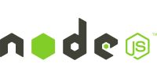
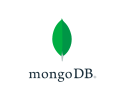

# Academic workstation Backend

# Features:

- CRUD for creation of users, students, teachers, activities and enrollments.
- JWT and hashing implementation for password security.
- Middlewares in charge of handling sensitive information and CORS.
- Environment variables for safe credentials.

# Frontend:

https://github.com/AlexisBaladon/Angular-AcademicWorkstation

# Technologies

- [node] - Backend framework for javascript.
- [mongodb] - NoSQL database for document storage.
- [typescript] - Static typing for javascript.
- [jwt] - Web standard for secure message transmition.

 

